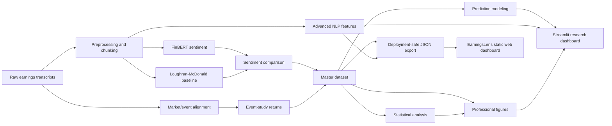

# EarningsLens — Earnings Call Sentiment Analyzer

A financial NLP research project that turns earnings-call transcripts into sentiment features, event-study return snapshots, statistical diagnostics, prediction-model scaffolding, professional figures, a Streamlit research dashboard, and a modern static-first Next.js dashboard.

> Current dataset status: the real checked output contains **1 transcript/event** (`AAPL_20201029`). Statistical tests and ML training are intentionally guarded. Charts are descriptive snapshots, not inferential conclusions.


The project now includes **EarningsLens**, a premium dark fintech web dashboard built as a static-first presentation layer over the existing Python NLP pipeline.

- **Modern web dashboard:** `web/`
- **Framework:** Next.js App Router, TypeScript, Tailwind CSS
- **UI/animation:** shadcn-style components, Recharts, Framer Motion, lucide-react
- **Data mode:** precomputed JSON in `web/public/data/dashboard.json`
- **Pipeline safety:** no model inference, training, transcript ingestion, or market downloads during builds or requests

Run it locally:

```bash
python3 scripts/export_web_data.py
cd web
npm ci
npm run dev
```

Then open:

```text
http://localhost:3000
```

## Problem Statement

Earnings calls contain forward-looking language, uncertainty, and management tone that can matter to investors. This project asks: can we build a transparent, end-to-end pipeline that compares contextual sentiment models with explainable financial lexicons, aligns those signals with post-earnings returns, and packages the results in a recruiter-friendly dashboard?

## Why Earnings Call Sentiment Matters

- Management tone can signal confidence, caution, or uncertainty beyond headline numbers.
- Analyst Q&A and prepared remarks often contain different information density.
- Comparing FinBERT with Loughran-McDonald helps balance contextual NLP with interpretable finance-specific word counts.
- Event-study alignment connects text signals to market reaction windows.

## Key Features

- Transcript cleaning, chunking, and metadata preservation.
- FinBERT sentiment scoring and Loughran-McDonald baseline scoring.
- FinBERT-vs-LM comparison metrics and agreement/divergence flags.
- Event-study returns and abnormal returns across 1D, 2D, 3D, 5D, and 10D windows.
- Master ML-ready dataset builder.
- Guarded statistical analysis with explicit `n=1` warnings.
- Advanced NLP features: keywords, topics, bigrams, uncertainty, and speaker/section sentiment when source labels are available.
- Prediction modeling module that skips training when data is insufficient.
- Professional PNG figures and a minimalist Streamlit dashboard.
- Static-first EarningsLens web dashboard with verified sentiment charts, topic features, honest speaker-data availability, event-study panels, artifact provenance, and recruiter-friendly project links.
- Repository health check script for GitHub readiness.

## Tech Stack

**Python pipeline:** Python 3.12, pandas, NumPy, PyArrow/Parquet, transformers/FinBERT, Loughran-McDonald dictionary, yfinance-style market data workflow, scipy, statsmodels, scikit-learn, matplotlib, Streamlit, pytest.

**Web dashboard:** Next.js App Router, TypeScript, Tailwind CSS, shadcn-style UI components, Recharts, Framer Motion, lucide-react.

## Pipeline Architecture



See [docs/architecture.md](docs/architecture.md) for a fuller module map and artifact map.

## Repository Structure

```text
src/
  sentiment/        FinBERT, LM baseline, sentiment aggregation
  finance/          Market data and return feature engineering
  event_study/      Event alignment, abnormal returns, CAR utilities
  analysis/         Comparison, master dataset, statistics
  nlp/              Advanced NLP features
  models/           Prediction modeling scaffolding
  visualization/    Professional static figures
app.py              Streamlit dashboard
web/                Next.js EarningsLens dashboard
  app/              App Router page and layout
  components/       Dashboard sections and UI primitives
  data/             Static product and architecture copy
  public/data/      Versioned deployment-safe JSON artifacts
  types/            Dashboard TypeScript types
scripts/            Pipeline runners, web exporter, and repo health check
data/processed/     Generated processed artifacts
reports/tables/     Generated CSV report tables
reports/figures/    Generated PNG figures
docs/               Methodology, architecture, installation, results
```

## Installation

```bash
python3.12 -m venv .venv
source .venv/bin/activate
pip install --upgrade pip
pip install -r requirements.txt
```

For development and tests:

```bash
pip install -r requirements-dev.txt
```

The Loughran-McDonald dictionary should be available at:

```text
data/dictionaries/loughran_mcdonald/LM_MasterDictionary.csv
```

More setup notes are in [docs/INSTALLATION.md](docs/INSTALLATION.md).

Install the web dashboard dependencies separately:

```bash
cd web
npm ci
```

## Run the Pipeline

Individual Day 10-15 modules are CLI-runnable, for example:

```bash
python3 src/analysis/master_dataset_builder.py
python3 src/analysis/statistical_analysis.py
python3 src/visualization/professional_charts.py
python3 src/nlp/advanced_nlp.py
python3 src/models/predictive_model.py
```

Run the repository health check:

```bash
python3 scripts/repo_health_check.py
```

Run tests:

```bash
python3 -m pytest -q
```

Regenerate the deployment-safe web artifact after the pipeline outputs change:

```bash
python3 scripts/export_web_data.py
```

The exporter reads existing CSV/JSON artifacts only. It does not load transformer weights, call market-data providers, or train a model. It converts unsupported and non-finite values to JSON-safe values and writes `web/public/data/dashboard.json`.

## Run the Dashboards

### Streamlit Research Dashboard

```bash
streamlit run app.py
```

The dashboard includes Overview, Sentiment Analysis, Event Study, Advanced NLP, Statistical Analysis, Prediction Modeling, Figures Gallery, and Downloads pages.

### EarningsLens Web Dashboard

```bash
python3 scripts/export_web_data.py
cd web
npm run dev
```

Open `http://localhost:3000`.

Production checks:

```bash
cd web
npm run validate:data
npm run lint
npm run typecheck
npm test
npm run build
```

The web dashboard is static-first and fetches the checked JSON artifact from `/data/dashboard.json`. It does not call a backend or modify the Python NLP pipeline.

### Environment Variables

No environment variables are required for the checked Python workflow or the current static web deployment. Vercel’s system-provided production URL is used for absolute social metadata. Future private provider credentials must remain server-side and must never use a `NEXT_PUBLIC_*` name.

## EarningsLens Web Sections

- Explicit `n=1` demonstration-dataset label and research caveats.
- Verified FinBERT probability distribution and Loughran-McDonald polarity counts.
- Real transcript topics, uncertainty ratio, token count, and exported keywords.
- Transparent speaker-data unavailable state instead of invented CEO/CFO values.
- Observed raw return, abnormal return, and CAR metrics from checked artifacts.
- Guarded predictive-model status showing 25 features and zero trained models.
- Architecture, provenance, methodology, loading, error, empty, and custom 404 views.

## Key Outputs

Verified generated outputs include:

- `data/processed/master_dataset.csv`
- `data/processed/master_dataset.parquet`
- `data/processed/nlp/advanced_nlp_features.csv`
- `reports/tables/statistical_summary.csv`
- `reports/tables/correlation_analysis.csv`
- `reports/tables/regression_results.csv`
- `reports/tables/prediction_model_summary.csv`
- `reports/figures/*.png`
- `models/predictive_model_metadata.json`
- `web/public/data/dashboard.json`

## Example Figures

Current generated figures live in `reports/figures/`:

- `sentiment_distribution.png`
- `finbert_lm_comparison.png`
- `returns_vs_sentiment.png`
- `event_study_return_horizon.png`
- `correlation_heatmap.png`
- `model_agreement_summary.png`

## Current Limitations

- The current real output contains one event: `AAPL_20201029`.
- Correlations, regressions, and t-tests are skipped or descriptive because `n=1`.
- Prediction modeling is pipeline-ready, but model training is skipped for fewer than 10 rows.
- The checked speaker summary has aggregate chunk sentiment but no speaker or section labels; the web UI reports that limitation directly.
- The deployed dashboard is a versioned snapshot and changes only after the exporter is rerun and the artifact is committed.
- Reported charts should be read as artifact and workflow demonstrations, not investment conclusions.

## Future Scope

- Scale to many tickers and multiple quarters.
- Add robust experiment tracking and model persistence after sample size grows.
- Expand speaker-role attribution and Q&A-specific analysis.
- Add confidence intervals and stronger event-study diagnostics with larger data.
- Add automated artifact regeneration after reviewed offline pipeline runs.
- Expand the deployed snapshot only when additional verified, non-sensitive records are available.
