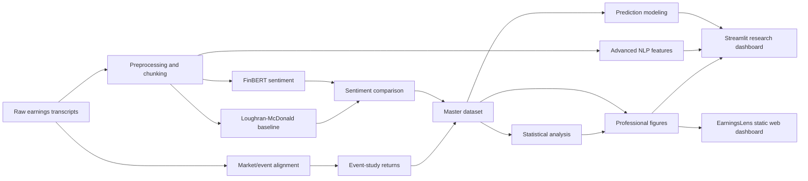

# EarningsLens — Earnings Call Sentiment Analyzer

A financial NLP research project that turns earnings-call transcripts into sentiment features, event-study return snapshots, statistical diagnostics, prediction-model scaffolding, professional figures, a Streamlit research dashboard, and a modern static-first Next.js dashboard.

> Current dataset status: the real checked output contains **1 transcript/event** (`AAPL_20201029`). Statistical tests and ML training are intentionally guarded. Charts are descriptive snapshots, not inferential conclusions.

## Dashboard Preview

The project now includes **EarningsLens**, a premium dark fintech web dashboard built as a static-first presentation layer over the existing Python NLP pipeline.

- **Modern web dashboard:** `web/`
- **Framework:** Next.js App Router, TypeScript, Tailwind CSS
- **UI/animation:** shadcn-style components, Recharts, Framer Motion, lucide-react
- **Data mode:** static TypeScript data in `web/data/`
- **Pipeline safety:** no backend calls and no changes to the core Python NLP workflow

Run it locally:

```bash
cd web
npm install
npm run dev
```

Then open:

```text
http://localhost:3000
```

## Problem Statement

Earnings calls contain forward-looking language, uncertainty, and management tone that can matter to investors. This project asks: can we build a transparent, end-to-end pipeline that compares contextual sentiment models with explainable financial lexicons, aligns those signals with post-earnings returns, and packages the results in a recruiter-friendly dashboard?

## Why Earnings Call Sentiment Matters

- Management tone can signal confidence, caution, or uncertainty beyond headline numbers.
- Analyst Q&A and prepared remarks often contain different information density.
- Comparing FinBERT with Loughran-McDonald helps balance contextual NLP with interpretable finance-specific word counts.
- Event-study alignment connects text signals to market reaction windows.

## Key Features

- Transcript cleaning, chunking, and metadata preservation.
- FinBERT sentiment scoring and Loughran-McDonald baseline scoring.
- FinBERT-vs-LM comparison metrics and agreement/divergence flags.
- Event-study returns and abnormal returns across 1D, 2D, 3D, 5D, and 10D windows.
- Master ML-ready dataset builder.
- Guarded statistical analysis with explicit `n=1` warnings.
- Advanced NLP features: keywords, topics, bigrams, uncertainty, speaker/section sentiment.
- Prediction modeling module that skips training when data is insufficient.
- Professional PNG figures and a minimalist Streamlit dashboard.
- Static-first EarningsLens web dashboard with animated hero, ticker strip, sentiment charts, model comparison, transcript timeline, speaker insights, event-study panel, and recruiter-friendly CTA links.
- Repository health check script for GitHub readiness.

## Tech Stack

**Python pipeline:** Python 3.12, pandas, NumPy, PyArrow/Parquet, transformers/FinBERT, Loughran-McDonald dictionary, yfinance-style market data workflow, scipy, statsmodels, scikit-learn, matplotlib, Streamlit, pytest.

**Web dashboard:** Next.js App Router, TypeScript, Tailwind CSS, shadcn-style UI components, Recharts, Framer Motion, lucide-react.

## Pipeline Architecture



See [docs/architecture.md](docs/architecture.md) for a fuller module map and artifact map.

## Repository Structure

```text
src/
  sentiment/        FinBERT, LM baseline, sentiment aggregation
  finance/          Market data and return feature engineering
  event_study/      Event alignment, abnormal returns, CAR utilities
  analysis/         Comparison, master dataset, statistics
  nlp/              Advanced NLP features
  models/           Prediction modeling scaffolding
  visualization/    Professional static figures
app.py              Streamlit dashboard
web/                Next.js EarningsLens dashboard
  app/              App Router page and layout
  components/       Dashboard sections and UI primitives
  data/             Static TypeScript dashboard data
  types/            Dashboard TypeScript types
scripts/            Pipeline runners and repo health check
data/processed/     Generated processed artifacts
reports/tables/     Generated CSV report tables
reports/figures/    Generated PNG figures
docs/               Methodology, architecture, installation, results
```

## Installation

```bash
python3.12 -m venv .venv
source .venv/bin/activate
pip install --upgrade pip
pip install -r requirements.txt
```

For development and tests:

```bash
pip install -r requirements-dev.txt
```

The Loughran-McDonald dictionary should be available at:

```text
data/dictionaries/loughran_mcdonald/LM_MasterDictionary.csv
```

More setup notes are in [docs/INSTALLATION.md](docs/INSTALLATION.md).

Install the web dashboard dependencies separately:

```bash
cd web
npm install
```

## Run the Pipeline

Individual Day 10-15 modules are CLI-runnable, for example:

```bash
python3 src/analysis/master_dataset_builder.py
python3 src/analysis/statistical_analysis.py
python3 src/visualization/professional_charts.py
python3 src/nlp/advanced_nlp.py
python3 src/models/predictive_model.py
```

Run the repository health check:

```bash
python3 scripts/repo_health_check.py
```

Run tests:

```bash
python3 -m pytest -q
```

## Run the Dashboards

### Streamlit Research Dashboard

```bash
streamlit run app.py
```

The dashboard includes Overview, Sentiment Analysis, Event Study, Advanced NLP, Statistical Analysis, Prediction Modeling, Figures Gallery, and Downloads pages.

### EarningsLens Web Dashboard

```bash
cd web
npm run dev
```

Open `http://localhost:3000`.

Production checks:

```bash
cd web
npm run lint
npm run build
```

The web dashboard is static-first and uses local TypeScript data from `web/data/`. It does not call a backend or modify the Python NLP pipeline.

## EarningsLens Web Sections

- Hero with animated metric cards for transcripts, chunks, FinBERT, LM signals, and event-study readiness.
- Moving financial ticker strip with sample company sentiment and price movement.
- Animated pipeline overview from transcript ingestion to predictive modeling.
- Sentiment engine charts for FinBERT distribution and Loughran-McDonald categories.
- FinBERT vs Loughran-McDonald comparison panel.
- Transcript chunk sentiment timeline across prepared remarks, financial results, guidance, and Q&A.
- Speaker-aware cards for CEO, CFO, analyst Q&A, and management tone.
- Event-study / market reaction chart for abnormal return and CAR.
- Predictive modeling status cards with clear insufficient-sample-size caveats.
- Apple Q4 2020 demo signal card and GitHub CTA links.

## Key Outputs

Verified generated outputs include:

- `data/processed/master_dataset.csv`
- `data/processed/master_dataset.parquet`
- `data/processed/nlp/advanced_nlp_features.csv`
- `reports/tables/statistical_summary.csv`
- `reports/tables/correlation_analysis.csv`
- `reports/tables/regression_results.csv`
- `reports/tables/prediction_model_summary.csv`
- `reports/figures/*.png`
- `models/predictive_model_metadata.json`

## Example Figures

Current generated figures live in `reports/figures/`:

- `sentiment_distribution.png`
- `finbert_lm_comparison.png`
- `returns_vs_sentiment.png`
- `event_study_return_horizon.png`
- `correlation_heatmap.png`
- `model_agreement_summary.png`

Dashboard screenshot placeholder:

```text
Add dashboard screenshot here: reports/screenshots/dashboard_overview.png
Add EarningsLens web screenshot here: reports/screenshots/earningslens_web_dashboard.png
```

## Current Limitations

- The current real output contains one event: `AAPL_20201029`.
- Correlations, regressions, and t-tests are skipped or descriptive because `n=1`.
- Prediction modeling is pipeline-ready, but model training is skipped for fewer than 10 rows.
- The EarningsLens web dashboard currently uses static/demo TypeScript data for recruiter-friendly product storytelling.
- Reported charts should be read as artifact and workflow demonstrations, not investment conclusions.

## Future Scope

- Scale to many tickers and multiple quarters.
- Add robust experiment tracking and model persistence after sample size grows.
- Expand speaker-role attribution and Q&A-specific analysis.
- Add confidence intervals and stronger event-study diagnostics with larger data.
- Generate dashboard-ready JSON artifacts directly from the Python pipeline.
- Deploy the Streamlit dashboard and EarningsLens web dashboard with reproducible artifact bundles.
