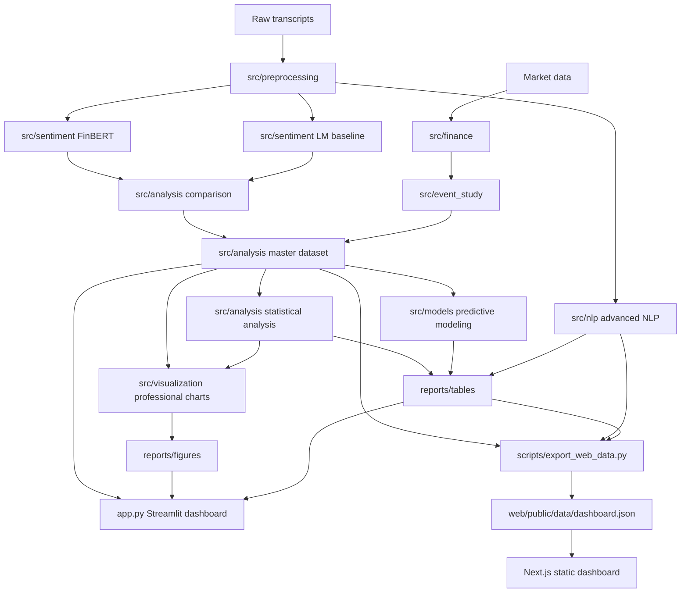
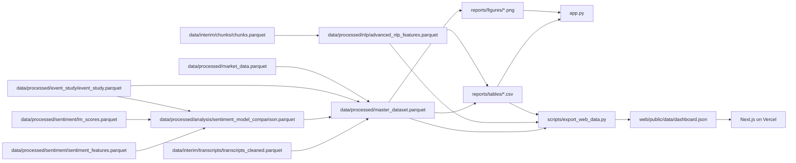

# Architecture

## High-Level Architecture

## Data Flow

## Module-Level Explanation

### `src/sentiment/`

Contains FinBERT scoring, Loughran-McDonald scoring, chunk aggregation, validation, and supporting NLP utilities.

### `src/finance/`

Handles market data loading, return computation, feature engineering, trading calendar helpers, and market dataset construction.

### `src/event_study/`

Implements event-window generation, abnormal returns, CAR calculations, sentiment/event merging, validation, and event-study orchestration.

### `src/analysis/`

Contains post-pipeline analysis modules:

- `sentiment_model_comparison.py`
- `master_dataset_builder.py`
- `statistical_analysis.py`

### `src/nlp/`

Adds advanced text features: keywords, topics, bigrams, uncertainty scoring, and speaker/section sentiment summaries.

### `src/models/`

Contains guarded prediction modeling. The current dataset has one row, so model training is skipped and metadata records the reason.

### `src/visualization/`

Generates static matplotlib PNG charts for reports and dashboard display.

### `app.py`

Streamlit dashboard that reads generated tables, figures, metadata, and processed datasets. It does not modify pipeline outputs.

### `scripts/export_web_data.py`

Reads existing checked CSV/JSON artifacts and writes a small JSON contract for the web application. It performs no transcript ingestion, market download, transformer inference, or model training and rejects non-finite JSON values.

### `web/`

Next.js App Router application deployed with `web/` as the Vercel Root Directory. Normal requests serve static UI assets and `web/public/data/dashboard.json`; the application does not require the Python runtime.

## Output Artifact Map

| Artifact | Purpose |
|---|---|
| `data/processed/master_dataset.parquet` | ML-ready merged dataset |
| `data/processed/master_dataset.csv` | CSV version of master dataset |
| `data/processed/nlp/advanced_nlp_features.csv` | Advanced NLP feature table |
| `reports/tables/statistical_summary.csv` | Statistical summary metrics |
| `reports/tables/correlation_analysis.csv` | Guarded correlation table |
| `reports/tables/regression_results.csv` | Guarded regression table |
| `reports/tables/prediction_model_summary.csv` | Prediction modeling summary |
| `reports/tables/prediction_model_metrics.csv` | Model status/metrics table |
| `reports/figures/*.png` | Static professional figures |
| `models/predictive_model_metadata.json` | Prediction metadata and skip reasons |
| `web/public/data/dashboard.json` | Versioned deployment-safe dashboard contract |
